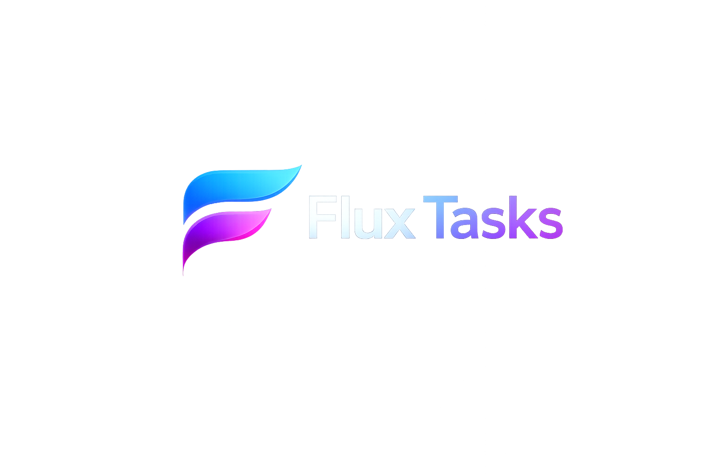

# 

# 

#

# Flux

#

### Premium Offline Project Manager

---

## Overview

Flux is a modern offline project management application built for developers, creators and technical teams.

It combines the best ideas from:

* Linear
* Notion
* Arc Browser
* Raycast
* Jira
* Obsidian

All data is stored locally.

No cloud.

No subscriptions.

No accounts.

No tracking.

---

## Features

### 📋 Task Management

Create and manage:

* Bugs
* Features
* Releases
* Refactors
* Documentation
* AI Prompts

---

### 🎨 Modern Liquid Glass UI

Inspired by:

* visionOS
* macOS
* Arc Browser
* Linear

Features:

* Dynamic gradients
* Glass effects
* Acrylic blur
* Smooth animations
* Custom accent colors

---

### 🗂 Projects

Organize tasks by project.

Examples:

* Bamboo Browser
* Flux
* Personal Projects
* Work Projects

---

### 🛣 Roadmap

Track future development.

Create:

* Versions
* Milestones
* Feature plans
* Release plans

---

### 📦 Release Management

Manage releases:

* Version
* Description
* Changelog
* Progress

---

### 🤖 Prompt Library

Store:

* ChatGPT prompts
* Gemini prompts
* Claude prompts
* Development prompts

---

### 💻 Code Snippets

Store:

* JavaScript
* TypeScript
* Python
* JSON
* HTML
* CSS
* SQL
* Bash
* PowerShell

Syntax highlighting included.

---

### 📎 Attachments

Attach:

* Images
* PDFs
* ZIP files
* Documentation
* Logs

---

### 📊 Dashboard

Overview:

* Active tasks
* Completed tasks
* Project progress
* Upcoming releases

---

### 🔍 Global Search

Search through:

* Tasks
* Descriptions
* Prompts
* Notes
* Code snippets

---

## Workflow

Task Types:

🐞 Bug

✨ Feature

🚀 Release

🔧 Refactor

📝 Documentation

🤖 AI Prompt

Task Statuses:

📌 Planned

⏳ Waiting

🚧 In Progress

🧪 Testing

✅ Completed

❌ Cancelled

---

## Technology

* Electron
* React
* TypeScript
* Vite
* SQLite
* Zustand
* Framer Motion

---

## License

MIT License

---

## Описание

Flux — современное локальное приложение для управления проектами, задачами и разработкой.

Программа создана для разработчиков, команд и создателей проектов.

Все данные хранятся локально.

Без облака.

Без подписок.

Без аккаунтов.

Без отслеживания.

---

## Возможности

### 📋 Управление задачами

Создание и управление:

* Багами
* Функциями
* Релизами
* Рефакторингом
* Документацией
* AI-промтами

---

### 🎨 Современный Liquid Glass интерфейс

Вдохновлено:

* visionOS
* macOS
* Arc Browser
* Linear

Особенности:

* Настраиваемые градиенты
* Стеклянные эффекты
* Acrylic Blur
* Плавные анимации
* Выбор акцентного цвета

---

### 🗂 Проекты

Группировка задач по проектам.

Примеры:

* Bamboo Browser
* Flux
* Личные проекты
* Рабочие проекты

---

### 🛣 Roadmap

Планирование разработки.

Поддержка:

* Версий
* Этапов
* Будущих функций
* Планов релизов

---

### 📦 Управление релизами

Для каждого релиза:

* Версия
* Описание
* Список изменений
* Прогресс

---

### 🤖 Библиотека промтов

Хранение:

* ChatGPT промтов
* Gemini промтов
* Claude промтов
* Технических промтов

---

### 💻 Хранилище кода

Поддержка:

* JavaScript
* TypeScript
* Python
* JSON
* HTML
* CSS
* SQL
* Bash
* PowerShell

С подсветкой синтаксиса.

---

### 📎 Вложения

Поддержка:

* Изображений
* PDF
* ZIP
* Документов
* Логов

---

### 📊 Дашборд

Отображает:

* Активные задачи
* Выполненные задачи
* Прогресс проектов
* Ближайшие релизы

---

### 🔍 Глобальный поиск

Поиск по:

* Задачам
* Описаниям
* Промтам
* Заметкам
* Коду

---

## Рабочий процесс

Типы задач:

🐞 Bug

✨ Feature

🚀 Release

🔧 Refactor

📝 Documentation

🤖 AI Prompt

Статусы:

📌 Запланировано

⏳ Ожидает

🚧 В работе

🧪 Тестирование

✅ Выполнено

❌ Отменено

---

## Технологии

* Electron
* React
* TypeScript
* Vite
* SQLite
* Zustand
* Framer Motion

---

## Лицензия

MIT License
